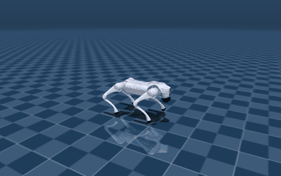
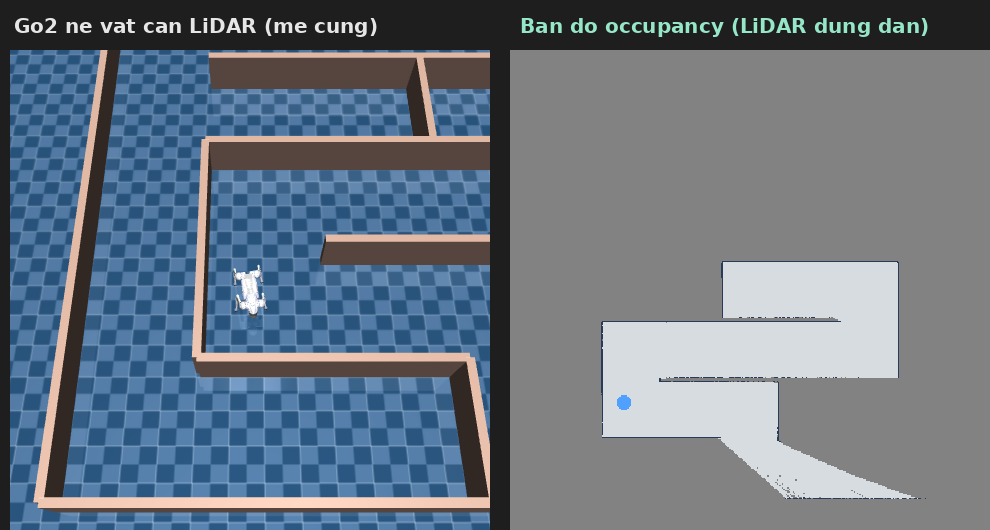
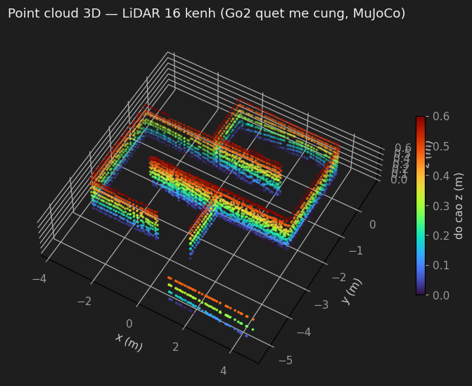

# Unitree Go2 — ROS 2 + Gazebo + RL

Mô phỏng robot 4 chân **Unitree Go2** xây từ đầu bằng **ROS 2 Jazzy + Gazebo Harmonic**
(không dùng champ / quadruped_ros2_control), kèm **RL locomotion** (chạy policy neural
thay gait rule-based), pipeline **vision follow-object** (camera + YOLO) và **né vật cản
+ điều hướng bằng LiDAR** (reactive avoidance, A* pathfinding, SLAM, point cloud).

<p align="center">
  <br>
  <em>RL policy (ONNX) điều khiển Go2 — đi thẳng, không drift, trong MuJoCo</em>
</p>

## Tính năng chính

| | Mô tả |
|---|---|
| 🦿 **Gait rule-based** | IK giải tích 3-DOF + trot gait, `/cmd_vel` → 12 khớp @ 50Hz (`quadruped_gait`) |
| 🎯 **Đi tới toạ độ** | Action `goto_point` — tới (x,y) rồi dừng (`quadruped_navigation`) |
| 👁️ **Follow-object** | Camera RGBD → YOLO → tracker → action `track_object` bám mục tiêu (`quadruped_perception` + `quadruped_follow`) |
| 🛰️ **LiDAR né vật cản** | Reactive VFH-lite: `/scan` → `/cmd_vel` né vật cản, không cần train (`quadruped_navigation`) |
| 🗺️ **Điều hướng + SLAM** | A* trên bản đồ occupancy → điểm đích; `slam_toolbox` dựng `/map`; point cloud 3D trong RViz |
| 🕹️ **Teleop** | Bảng joystick ảo Tkinter + khung camera kèm bounding box (`quadruped_teleop`) |
| 🧠 **RL locomotion** | Chạy policy ONNX pretrained thay gait; obs 45 chiều → PD torque (`quadruped_rl`) |

## Cấu trúc package

| Package | Vai trò |
|---|---|
| `quadruped_description` | URDF Go2 (xacro), world, controller config, LiDAR + camera sensor, launch spawn |
| `quadruped_gait` | IK (`leg_ik.py`) + trot (`trot_gait.py`) + `gait_node.py` |
| `quadruped_navigation` | `goto_point_server` (đi tới x,y) + `obstacle_avoider` (né LiDAR reactive) + `planner` (A* + pure pursuit) + launch SLAM |
| `quadruped_perception` | Camera → YOLO `object_detector` → `tracker` → `target_pose_node` |
| `quadruped_follow` | `track_object_server` (PID bám, giữ `stop_distance`) |
| `quadruped_teleop` | Joystick ảo + hiển thị camera/detection |
| `quadruped_rl` | RL policy ONNX → effort/PD; + `mujoco_demo/` (joystick, LiDAR né, điều hướng, mê cung) |
| `quadruped_interfaces` | Action `GotoPoint`, `TrackObject`; msg `TrackedTarget` |

## Chạy nhanh

```bash
source /opt/ros/jazzy/setup.bash
source ~/Ros2/quadruped_ws/install/setup.bash

# Mô phỏng đầy đủ (gait + follow-object)
ros2 launch quadruped_bringup quadruped_sim.launch.py headless:=true

# RL locomotion (policy neural thay gait)
ros2 launch quadruped_rl rl_locomotion.launch.py headless:=true

# LiDAR né vật cản + SLAM dựng bản đồ (can: sudo apt install ros-jazzy-slam-toolbox)
ros2 launch quadruped_navigation lidar_slam.launch.py
```

Build: `cd ~/Ros2/quadruped_ws && colcon build --symlink-install`

## LiDAR: né vật cản + điều hướng

Policy RL chỉ nhận **cảm biến nội tại (obs 45 chiều)** — KHÔNG có input LiDAR. Nên né
vật cản là **một lớp riêng** định hình `/cmd_vel` (không đưa vào policy), không cần train:

- **Reactive avoidance** (`obstacle_avoider.py`, VFH-lite): chia scan thành quạt trước/
  trái/phải → đi thẳng khi thoáng, bẻ về phía thoáng hơn khi gặp vật cản, lùi nhẹ + xoay
  mạnh khi bị chặn sát để thoát góc. Đã kiểm chứng trong Gazebo (gần nhất ≥0.87m, không đâm).
- **Điều hướng có đích** (`planner.py`): **A\*** trên lưới occupancy (đã phình an toàn theo
  bán kính robot) → bám đường bằng **pure pursuit holonomic** (đi ngang được vì robot 4 chân).
- **SLAM**: `slam_toolbox` (async) dựng `/map` khi robot tự đi né vòng quanh.

Mọi module logic thuần đều có **self-test độc lập** (chạy `python3 -m quadruped_navigation.<module>`,
không cần ROS/Gazebo).

<p align="center">
  <br>
  <em>Go2 tự né vật cản bằng LiDAR trong mê cung 7×7 (trái) + bản đồ occupancy dựng dần khi quét (phải)</em>
</p>

<p align="center">
  <br>
  <em>Point cloud 3D (LiDAR 16 kênh) tích luỹ khi robot quét mê cung — publish ra RViz qua <code>/mujoco/points</code></em>
</p>

## RL locomotion: MuJoCo vs Gazebo

Policy `unitree-go2-velocity-flat` (HuggingFace, BSD-3) chạy **đẹp trong MuJoCo**
(sim gốc của nó — đứng yên tuyệt đối khi lệnh=0, đi thẳng) nhưng **bị trôi trong
Gazebo** do gap sim-to-sim (mô hình actuator/contact khác). Pipeline tích hợp ROS2
(obs 45, remap khớp `joint_ids_map`, PD 2 vòng, effort + startup hand-off) tái dùng
nguyên vẹn — muốn hết drift thì train lại policy bằng chính URDF (Genesis).

### Demo MuJoCo: joystick, LiDAR né, điều hướng, mê cung

```bash
cd ~/Ros2/quadruped_ws/src/quadruped_rl/mujoco_demo

DISPLAY=:1 python3 mujoco_joystick.py            # lai tay - nen phang
DISPLAY=:1 python3 mujoco_joystick.py obstacles  # lai tay - cau thang + chuong ngai
DISPLAY=:1 python3 mujoco_lidar_avoid.py         # TU DONG ne vat can bang LiDAR + dung ban do
DISPLAY=:1 python3 mujoco_lidar_nav.py           # DIEU HUONG: click dich tren ban do -> A* -> toi noi
python3 mujoco_lidar_rviz.py                     # publish PointCloud2 3D -> xem trong RViz (source ROS)

# Chay trong ME CUNG (them tham so 'maze'); sinh me cung moi bang gen_maze.py:
python3 gen_maze.py 7 42                          # me cung 7x7 (N le -> robot o o giua)
DISPLAY=:1 python3 mujoco_lidar_avoid.py maze     # ne vat can trong me cung
DISPLAY=:1 python3 mujoco_lidar_nav.py maze       # dieu huong A* qua me cung
```

<p align="center">
   buc -> cau thang">
</p>

Các app LiDAR **tái dùng chính** `obstacle_avoider.py`/`planner.py` từ `quadruped_navigation`
(cùng logic đã self-test), chỉ thay nguồn scan bằng `mujoco.mj_ray`. Xem
`quadruped_ws/src/quadruped_rl/mujoco_demo/README.md` để biết chi tiết + lưu ý (LiDAR z=0.5,
hiện vật cản group 3).

## Tài liệu

`quadruped_ros_system.md` (kiến trúc), `quadruped_implementation.md`,
`quadruped_config_explained.md`, `quadruped_math_formulas.md`, `CLAUDE.md`, `TODO.md`.

## Nguồn / license

- URDF Go2: [unitreerobotics/unitree_ros](https://github.com/unitreerobotics/unitree_ros) (BSD-3)
- RL policy: [diasAiMaster/unitree-go2-velocity-flat](https://huggingface.co/diasAiMaster/unitree-go2-velocity-flat) (BSD-3)
- MuJoCo model: [MuJoCo Menagerie unitree_go2](https://github.com/google-deepmind/mujoco_menagerie) (BSD-3)
- YOLO: [ultralytics](https://github.com/ultralytics/ultralytics)
