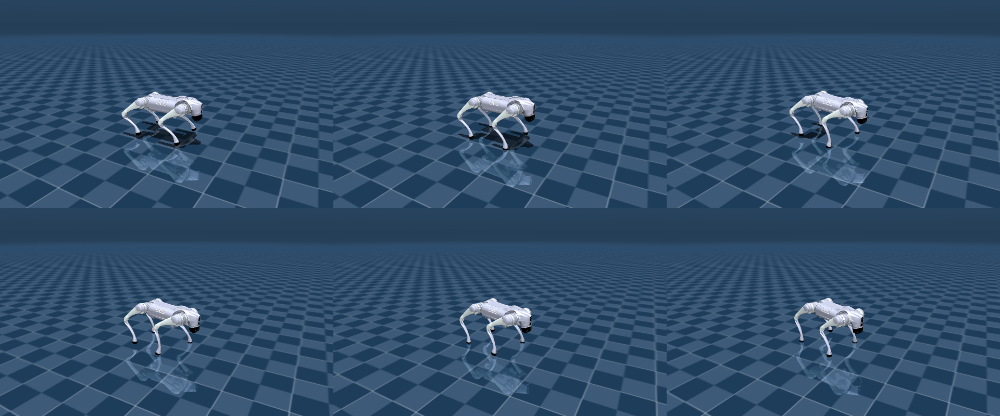
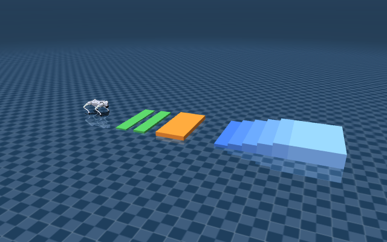

# MuJoCo joystick demo — lái Go2 bằng RL policy

Chạy policy `unitree-go2-velocity-flat` (ONNX) trong **MuJoCo** (sim gốc của nó, đi
chuẩn không drift, khác Gazebo) và **lái bằng cần gạt ảo**. Không cần ROS.

<p align="center">
  <br>
  <em>Go2 đi bằng RL policy (6 khung hình) — dáng trot, thân giữ ~0.32m</em>
</p>



## Cài 1 lần (nếu chưa)

```bash
python3 -m pip install --user --break-system-packages mujoco onnxruntime pillow
```

Model Go2 (`go2_model/`) là MuJoCo Menagerie (BSD, ~30MB, đã `.gitignore`). Nếu thiếu:
```bash
cd /tmp && git clone --depth 1 --filter=blob:none --sparse \
  https://github.com/google-deepmind/mujoco_menagerie.git
cd mujoco_menagerie && git sparse-checkout set unitree_go2
cp -r unitree_go2 ~/Ros2/quadruped_ws/src/quadruped_rl/mujoco_demo/go2_model
# copy lai scene_obstacles.xml vao go2_model/ (xem git)
```

## Mở

```bash
export DISPLAY=:1                      # neu chay tren may co man hinh :1
cd ~/Ros2/quadruped_ws/src/quadruped_rl/mujoco_demo

python3 mujoco_joystick.py             # lai tay - nen phang
python3 mujoco_joystick.py obstacles   # lai tay - cau thang + chuong ngai
python3 mujoco_lidar_avoid.py          # TU DONG ne vat can bang LiDAR + dung ban do
python3 mujoco_lidar_nav.py            # DIEU HUONG: click dich tren ban do -> A* -> toi noi
python3 mujoco_lidar_rviz.py          # publish PointCloud2 3D -> xem trong RViz (can source ROS)
```

**Chọn cảnh:** thêm tham số `maze` để chạy trong **mê cung** thay vì phòng trống:
```bash
python3 mujoco_lidar_avoid.py maze     # né vật cản trong mê cung
python3 mujoco_lidar_nav.py maze       # điều hướng A* qua mê cung (click đích)
python3 mujoco_lidar_rviz.py maze      # point cloud mê cung trong RViz
```
Sinh mê cung mới (recursive backtracker, mọi ngõ thông nhau, robot ở ô giữa):
```bash
python3 gen_maze.py [N] [seed]         # vd: python3 gen_maze.py 6 42  -> me cung 6x6
```

**Luu y hien vat can:** vat can trong `scene_lidar.xml` o **group 3** (de raycast chi bat
vat can, khong trung robot). MuJoCo Renderer AN group 3,4,5 mac dinh -> phai bat bang
`opt = mujoco.MjvOption(); opt.geomgroup[3] = 1` roi `update_scene(d, cam, opt)` (da lam
trong cac app). Neu khong se khong thay tuong/cot du chung van chan LiDAR.

### An toàn & làm mượt lệnh (dùng chung mọi app)

Ba cơ chế đã thêm vào chuỗi lệnh (`quadruped_navigation/obstacle_avoider.py`, có self-test),
đều **kiểm chứng bằng cách chạy chính class App thật** (driver gọi `_tick` lặp — bản mô phỏng
thuần bị lệch do onnxruntime đa luồng phi tất định):

- **Clamp lệnh yaw `wz ∈ [-0.75, +1.0]`** — đã đo: `wz ≤ -0.80` (xoay CW gấp) làm robot **ngã**
  (z tụt 0.33→0.22, nghiêng ~28°); `-0.75` còn vững. Chú ý `max_wz=1.2` của avoidance vượt cả
  dải train `[-1,1]` của policy → bắt buộc clamp trước khi vào policy.
- **`SlewLimiter`** (giới hạn tốc độ đổi lệnh) — reactive nhảy lệnh đột ngột ở góc (đo: `max|Δwz|`
  ~0.63 rad/s/tick → giật). Slew ép mượt → `max|Δwz|` 0.63 **→ 0.15**, cua không giật, vẫn né kịp.
- **`StuckEscape`** — né reactive không nhớ đường nên kẹt ở ngõ cụt; helper này phát hiện không
  tiến được rồi ra **động tác thoát cam kết một chiều** (lùi + xoay) để gỡ.

### `mujoco_lidar_avoid.py` — LiDAR né vật cản + bản đồ (không train, không ROS)

Robot **tự đi né vật cản** bằng LiDAR mô phỏng (`mujoco.mj_ray`, 90 tia, chỉ quét vật cản
group 3) → `compute_avoidance` (tái dùng từ `quadruped_navigation`, đã self-test) → `cmd_vel`
→ **policy RL đi**. Cửa sổ 2 khung: MuJoCo (robot né) + **bản đồ occupancy** dựng dần.

- **Phòng trống thưa vật cản** (`scene_lidar.xml`, chạy không kèm `maze`): hoạt động tốt,
  gần nhất tới vật cản ~0.85m, không đâm.
- **Mê cung** (`maze`): đã giảm `cruise_vx` 0.55→**0.45** + né sớm hơn để **không còn đập tường/ngã**
  (trước: lao 0.55 vào ngõ cụt → nghiêng 28° → kẹt). Kèm SlewLimiter + StuckEscape. **Nhưng** né
  reactive vẫn **có thể kẹt ở ngõ cụt** (RL policy đi lùi kém, khó lùi ra) — đây là giới hạn bản
  chất của reactive. **Đi mê cung tin cậy thì dùng `mujoco_lidar_nav.py maze`** (bên dưới).

### `mujoco_lidar_nav.py` — điều hướng tới đích (A* + pure pursuit) — *đúng công cụ cho mê cung*

**Click 1 điểm trên bản đồ** → robot tự lập đường (**A\*** trên lưới occupancy đã phình
an toàn) → **bám đường bằng pure pursuit holonomic** (đi thẳng tới đích bằng vx+vy vì
robot 4 chân đi ngang được) → **policy RL đi**. Logic thuần ở `quadruped_navigation/planner.py`
(A*, inflate, pure_pursuit — có self-test).

Đã tinh chỉnh cho **mê cung** (đo bằng App thật, đích ở tâm ô `{-3,-1.5,0,1.5,3}²`):
- Khi A* **chưa có đường** (bản đồ chưa đủ) → **roam khám phá** bằng reactive để xây thêm bản đồ,
  thay vì đi thẳng đâm tường; bản đồ đủ thì A* ra đường.
- `MAP_M` 4→5 (phủ hết mê cung ±4.5m), inflation 0.35→0.28m (tránh A* hết đường ở hành lang 1.4m),
  replan 40→18 tick, `cruise` 0.6→0.45 / `lookahead` 0.9→0.7.

**Kết quả:** **không bao giờ ngã** (min up-vector = −1.00 mọi lần), tới **4/6** đích góc xa; vài đích
"phía bắc" chậm/chưa tới trong thời gian test (bản đồ dựng dần phải khám phá nhiều — giới hạn của
mapping tăng dần, không phải ngã). Phòng trống thì tới đích qua vật cản, gần nhất ~0.43m.

### `mujoco_lidar_rviz.py` — point cloud 3D trong RViz

Chạy MuJoCo (headless, không cần GL) + LiDAR 3D (16 kênh × 120 tia bằng `mj_ray`) →
publish **`sensor_msgs/PointCloud2`** trên `/mujoco/points` (frame `odom`) + TF
`odom→base_link` + Marker robot. Robot tự né vật cản đi quanh → đám mây điểm 3D lớn dần.

```bash
source /opt/ros/jazzy/setup.bash && source ~/Ros2/quadruped_ws/install/setup.bash
python3 mujoco_lidar_rviz.py
rviz2 -d config_rviz.rviz     # fixed frame: odom; PointCloud2 /mujoco/points, màu theo Z
```

Đã kiểm chứng: `/mujoco/points` ~10Hz, đám mây dựng dần cả phòng (tường cầu vồng theo độ cao + cột).

Cửa sổ **"Go2 Joystick — MuJoCo"** hiện ra (Alt+Tab nếu bị che).

## Điều khiển

| Widget | Tác dụng |
|---|---|
| Cần trái (vòng tròn) | Kéo lên/xuống = tiến/lùi (vx); trái/phải = đi ngang (vy) |
| Cần phải (thanh ngang) | Xoay trái/phải (wz) |
| Thanh **Tốc độ** + nút −/+ | Nhân vận tốc 0.2×–2.0× (đà mạnh hơn để vượt gờ) |
| Nút **RESET tư thế** | Dựng lại robot khi ngã |
| Thả chuột | Cần về giữa → robot dừng |

## Lưu ý

Policy này **train trên nền phẳng + mù** (obs không có địa hình). Gờ thấp thường vượt
được; **cầu thang gần như chắc ngã** — đó là test giới hạn, không phải lỗi. Muốn leo
địa hình thật cần policy train rough-terrain + perception (hướng khác).
